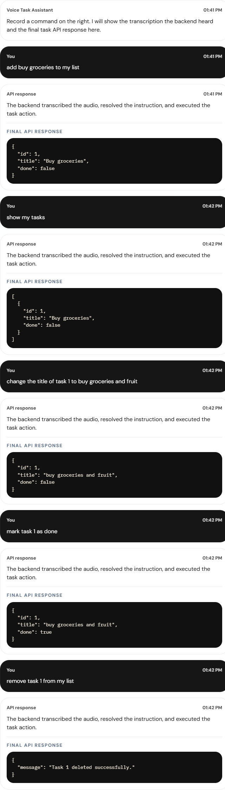

# Demo Screenshots

This file contains the captured demo evidence for the completed Voice Command API project.

## Full Successful Transcript

The screenshot below shows the full successful manual demo flow in a single image:

- create task
- list tasks
- update task title
- mark task as done
- delete task

## Commands Used In The Demo

1. `add buy groceries to my list`
2. `show my tasks`
3. `change the title of task 1 to buy groceries and fruit`
4. `mark task 1 as done`
5. `remove task 1 from my list`